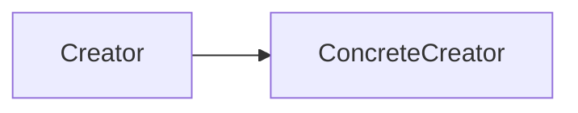

# KIWI CODEX 知识库网站 实施计划

> **For agentic workers:** REQUIRED SUB-SKILL: Use superpowers:subagent-driven-development (recommended) or superpowers:executing-plans to implement this plan task-by-task. Steps use checkbox (`- [ ]`) syntax for tracking.

**Goal:** 在 vault 内用 MkDocs Material 搭一个私人、本地优先的知识库网站，暗色游戏化 CODEX 风格 + 机械风「调取档案」特效。

**Architecture:** `build_docs.py` 把 vault 的三个知识目录（40/30/20）只读同步进 `site_docs/`（vault 笔记零改动），MkDocs Material 以 `site_docs/` 为内容源构建；站点自有资源（CSS/JS/首页/模板覆盖）放 git 跟踪的 `site_src/`，避免被同步脚本清空。视觉与特效通过 `codex.css` + `codex.js` + `overrides/main.html` 注入。

**Tech Stack:** Python 3.14、MkDocs、Material for MkDocs、mkdocs-roamlinks-plugin、mkdocs-callouts、mkdocs-awesome-pages-plugin、pymdown-extensions、jieba；pytest 做 build_docs 单测。

## Global Constraints

- Python 3.14；所有依赖装进项目 `.venv/`（gitignore），命令用 `.venv/Scripts/python`、`.venv/Scripts/mkdocs`、`.venv/Scripts/pytest`。
- **绝不修改** vault 现有笔记（`40_知识库`/`30_研究`/`20_项目` 及其它目录）——build_docs 只读拷贝。
- gitignore 必含：`.venv/`、`site_docs/`、`site/`（`.superpowers/` 已加）。
- 暗色 Material `scheme: slate`；**主强调青 `#5AD7E6`、次强调金 `#FFC24B`**；背景 `#0B1017`、面板 `#10161F`/`#161E2A`、描边 `#232E3B`/`#2E3A49`、正文 `#DCE3EC`、次要 `#6E7C8C`。
- 字体：标题 `Chakra Petch`；正文 `Inter` + 系统中文栈 `PingFang SC, Microsoft YaHei`；代码/数据 `JetBrains Mono`。
- 必须支持：`[[wikilink]]`、`![[图片]]` 嵌入、callout `> [!note]`、mermaid、中文全文搜索。
- 特效尊重 `prefers-reduced-motion: reduce`（关闭动画、直显最终态）。
- 运行方式：`.venv/Scripts/python build_docs.py && .venv/Scripts/mkdocs serve` → http://localhost:8000。
- 所有命令在 vault 根 `F:/20_Areas/Knowledge/my-vault` 下执行（bash shell，Unix 路径语法）。

---

### Task 1: Python 环境与依赖

**Files:**
- Create: `requirements.txt`
- Modify: `.gitignore`

**Interfaces:**
- Produces: 可用的 `.venv`，`.venv/Scripts/mkdocs` 与 `.venv/Scripts/pytest` 可执行。

- [ ] **Step 1: 写 requirements.txt**

```
mkdocs-material>=9.5
mkdocs-roamlinks-plugin>=0.3.2
mkdocs-callouts>=1.13
mkdocs-awesome-pages-plugin>=2.9
pymdown-extensions>=10.7
jieba>=0.42
pytest>=8.0
```

- [ ] **Step 2: 在 .gitignore 追加忽略项**

在 `.gitignore` 末尾追加（`.superpowers/` 已存在则不重复）：

```
.venv/
site_docs/
site/
```

- [ ] **Step 3: 创建虚拟环境并安装依赖**

Run:
```bash
cd "F:/20_Areas/Knowledge/my-vault" && python -m venv .venv && .venv/Scripts/python -m pip install -U pip -r requirements.txt
```
Expected: 安装成功，末尾 `Successfully installed mkdocs-material ... jieba ... pytest ...`。
（若 Python 3.14 某包无 wheel 而报错，记录报错包名，降到最近可用版本或改用 3.12 venv：`py -3.12 -m venv .venv`。）

- [ ] **Step 4: 验证工具可用**

Run:
```bash
cd "F:/20_Areas/Knowledge/my-vault" && .venv/Scripts/mkdocs --version && .venv/Scripts/pytest --version
```
Expected: 打印 `mkdocs, version 1.x` 与 `pytest 8.x`。

- [ ] **Step 5: Commit**

```bash
cd "F:/20_Areas/Knowledge/my-vault" && git add requirements.txt .gitignore && git commit -m "chore(codex): 添加 MkDocs 依赖与忽略项"
```

---

### Task 2: build_docs.py 同步脚本（TDD）

**Files:**
- Create: `build_docs.py`
- Test: `tests/test_build_docs.py`

**Interfaces:**
- Produces:
  - `convert_embeds(text: str) -> str`——`![[x.png]]`/`![[x.png|alt]]` → ``，普通 `[[双链]]` 不动。
  - `build(vault: Path, out: Path, assets: Path) -> None`——清空并重建 `out`，把 `40_知识库/30_研究/20_项目` 拷成 `out/知识库|研究|项目`，md 做嵌入转换，并从 `assets` 拷入 `index.md/stylesheets/javascripts`。

- [ ] **Step 1: 写失败测试**

Create `tests/test_build_docs.py`:
```python
import sys
from pathlib import Path
sys.path.insert(0, str(Path(__file__).resolve().parent.parent))
import build_docs


def test_convert_image_embed():
    assert build_docs.convert_embeds("![[mermaid-diagram.png]]") == ""


def test_convert_image_embed_with_alias():
    assert build_docs.convert_embeds("![[a.png|320]]") == ""


def test_convert_leaves_wikilink_untouched():
    assert build_docs.convert_embeds("见 [[工厂方法模式]]") == "见 [[工厂方法模式]]"


def test_build_creates_partitions(tmp_path):
    for d, f in (("40_知识库", "a.md"), ("30_研究", "b.md"), ("20_项目", "c.md")):
        (tmp_path / d).mkdir()
        (tmp_path / d / f).write_text("# t", encoding="utf-8")
    (tmp_path / "40_知识库" / "attachments").mkdir()
    (tmp_path / "40_知识库" / "attachments" / "p.png").write_bytes(b"x")
    assets = tmp_path / "site_src"; assets.mkdir()
    (assets / "index.md").write_text("home", encoding="utf-8")
    out = tmp_path / "site_docs"
    build_docs.build(tmp_path, out, assets)
    assert (out / "知识库" / "a.md").exists()
    assert (out / "研究" / "b.md").exists()
    assert (out / "项目" / "c.md").exists()
    assert (out / "知识库" / "attachments" / "p.png").exists()
    assert (out / "index.md").exists()
```

- [ ] **Step 2: 运行确认失败**

Run: `cd "F:/20_Areas/Knowledge/my-vault" && .venv/Scripts/pytest tests/test_build_docs.py -q`
Expected: FAIL，`ModuleNotFoundError: No module named 'build_docs'`。

- [ ] **Step 3: 实现 build_docs.py**

Create `build_docs.py`:
```python
#!/usr/bin/env python3
"""把 vault 知识类目录同步到 MkDocs 内容源目录 site_docs/。vault 笔记只读。"""
import re
import shutil
from pathlib import Path

VAULT = Path(__file__).resolve().parent
OUT = VAULT / "site_docs"
ASSETS = VAULT / "site_src"

PARTITIONS = {"40_知识库": "知识库", "30_研究": "研究", "20_项目": "项目"}

_EMBED_IMG = re.compile(
    r"!\[\[([^\]|]+\.(?:png|jpe?g|gif|svg|webp))(?:\|[^\]]*)?\]\]", re.IGNORECASE
)


def convert_embeds(text: str) -> str:
    """Obsidian 图片嵌入 ![[x.png]] / ![[x.png|alt]] → 标准 。普通双链不动。"""
    return _EMBED_IMG.sub(lambda m: f"})", text)


def _clean(out: Path) -> None:
    if out.exists():
        shutil.rmtree(out)
    out.mkdir(parents=True)


def _copy_partition(src: Path, dst: Path) -> None:
    for p in src.rglob("*"):
        target = dst / p.relative_to(src)
        if p.is_dir():
            target.mkdir(parents=True, exist_ok=True)
        elif p.suffix.lower() == ".md":
            target.parent.mkdir(parents=True, exist_ok=True)
            target.write_text(convert_embeds(p.read_text(encoding="utf-8")), encoding="utf-8")
        else:
            target.parent.mkdir(parents=True, exist_ok=True)
            shutil.copy2(p, target)


def _copy_assets(assets: Path, out: Path) -> None:
    for name in ("index.md", "stylesheets", "javascripts"):
        s = assets / name
        if s.is_dir():
            shutil.copytree(s, out / name, dirs_exist_ok=True)
        elif s.is_file():
            shutil.copy2(s, out / name)


def build(vault: Path = VAULT, out: Path = OUT, assets: Path = ASSETS) -> None:
    _clean(out)
    for src_name, part in PARTITIONS.items():
        src = vault / src_name
        if src.exists():
            _copy_partition(src, out / part)
    _copy_assets(assets, out)


if __name__ == "__main__":
    build()
    print(f"已构建 {OUT}")
```

- [ ] **Step 4: 运行确认通过**

Run: `cd "F:/20_Areas/Knowledge/my-vault" && .venv/Scripts/pytest tests/test_build_docs.py -q`
Expected: PASS，`4 passed`。

- [ ] **Step 5: 对真实 vault 跑一次并检查**

Run:
```bash
cd "F:/20_Areas/Knowledge/my-vault" && mkdir -p site_src && printf '# KIWI CODEX\n\n技术图鉴首页占位。\n' > site_src/index.md && .venv/Scripts/python build_docs.py && ls site_docs
```
Expected: 打印 `已构建 …/site_docs`，`ls` 显示 `知识库 研究 项目 index.md`。

- [ ] **Step 6: Commit**

```bash
cd "F:/20_Areas/Knowledge/my-vault" && git add build_docs.py tests/test_build_docs.py site_src/index.md && git commit -m "feat(codex): build_docs 同步脚本 + 单测"
```

---

### Task 3: mkdocs.yml 与首次成功构建

**Files:**
- Create: `mkdocs.yml`

**Interfaces:**
- Consumes: `site_docs/`（Task 2 产出）、`site_src/index.md`。
- Produces: 可 `mkdocs build` 成功的配置；`site/` 产物。

- [ ] **Step 1: 写 mkdocs.yml**

Create `mkdocs.yml`:
```yaml
site_name: KIWI CODEX
site_description: keywei 的私人技术图鉴
docs_dir: site_docs
site_dir: site
use_directory_urls: true

theme:
  name: material
  language: zh
  custom_dir: site_src/overrides
  palette:
    scheme: slate
    primary: black
    accent: cyan
  font:
    text: Inter
    code: JetBrains Mono
  features:
    - navigation.instant
    - navigation.sections
    - navigation.top
    - navigation.tracking
    - toc.follow
    - search.highlight
    - search.suggest
    - content.code.copy

extra_css:
  - stylesheets/codex.css
extra_javascript:
  - javascripts/codex.js

plugins:
  - search
  - awesome-pages
  - roamlinks
  - callouts

markdown_extensions:
  - meta
  - admonition
  - attr_list
  - md_in_html
  - toc:
      permalink: true
  - pymdownx.highlight:
      anchor_linenums: true
  - pymdownx.inlinehilite
  - pymdownx.superfences:
      custom_fences:
        - name: mermaid
          class: mermaid
          format: !!python/name:pymdownx.superfences.fence_code_format
```

- [ ] **Step 2: 建占位资源目录（避免 custom_dir/extra 引用报错）**

Run:
```bash
cd "F:/20_Areas/Knowledge/my-vault" && mkdir -p site_src/overrides site_src/stylesheets site_src/javascripts && touch site_src/stylesheets/codex.css site_src/javascripts/codex.js && .venv/Scripts/python build_docs.py
```
Expected: 无报错，`site_docs/stylesheets/codex.css`、`site_docs/javascripts/codex.js` 存在。

- [ ] **Step 3: 构建站点验证成功**

Run: `cd "F:/20_Areas/Knowledge/my-vault" && .venv/Scripts/mkdocs build 2>&1 | tail -20`
Expected: `INFO - Documentation built in ... seconds`，无 ERROR（WARNING 关于 nav/链接可暂忽略）。生成 `site/index.html`。

- [ ] **Step 4: Commit**

```bash
cd "F:/20_Areas/Knowledge/my-vault" && git add mkdocs.yml site_src/overrides site_src/stylesheets site_src/javascripts && git commit -m "feat(codex): mkdocs.yml 配置与首次构建"
```

---

### Task 4: Obsidian 特性接入验证

**Files:**
- Create: `tests/fixtures/feature_probe.md`（临时探针，验证后删）
- Modify: `mkdocs.yml`（如某特性需调参）

**Interfaces:**
- Consumes: Task 3 的可构建配置。
- Produces: 已确认 wikilink/callout/mermaid/图片/中文搜索均生效。

- [ ] **Step 1: 造一个覆盖各特性的探针笔记**

Create `40_知识库/_feature_probe.md`（放 vault 真实目录，验证后删；下面用 `~~~~` 围栏以便内含 ```mermaid 代码块）:

~~~~markdown
---
type: 测试
tags: [探针, UE]
created: 2026-07-16
---
# 特性探针

跳转测试：见 [[UE设计模式-工厂方法模式（GameSettingScreen.CreateRegistry）]]。

> [!note] 提示框
> 这段应渲染成 Material admonition。

图片嵌入：![[mermaid-diagram.png]]


~~~~

（该图片实际位于 `40_知识库/attachments/mermaid-diagram.png`，与探针同分区，相对引用成立。）

- [ ] **Step 2: 重建并构建**

Run: `cd "F:/20_Areas/Knowledge/my-vault" && .venv/Scripts/python build_docs.py && .venv/Scripts/mkdocs build 2>&1 | tail -5`
Expected: 构建成功。

- [ ] **Step 3: 断言各特性已渲染进 HTML**

Run:
```bash
cd "F:/20_Areas/Knowledge/my-vault" && f="site/知识库/_feature_probe/index.html"; test -f "$f" && echo "found $f"; \
grep -c 'class="admonition' "$f"; \
grep -c 'class="mermaid"' "$f"; \
grep -c '.md-nav__link{color:var(--cx-cyan)}
/* 交叉引用（正文站内链接）点下划 + hover 扫光 */
.md-typeset a:not(.md-button){
  border-bottom:1px dotted var(--cx-cyan-d);
  background:linear-gradient(90deg,transparent,rgba(90,215,230,.22),transparent);
  background-size:220% 100%;background-position:-110% 0;transition:background-position .45s}
.md-typeset a:not(.md-button):hover{background-position:110% 0}
/* 档案属性带（Task 6 注入 .cx-meta） */
.cx-meta{display:flex;flex-wrap:wrap;border:1px solid var(--cx-line2);background:var(--cx-field);
  margin:0 0 1.2rem;font-family:"JetBrains Mono",monospace;font-size:.62rem;
  clip-path:polygon(0 0,calc(100% - 12px) 0,100% 12px,100% 100%,0 100%)}
.cx-meta span{padding:.35rem .7rem;border-right:1px solid var(--cx-line);color:var(--cx-muted)}
.cx-meta b{color:var(--cx-cyan);font-weight:600}
/* admonition / 代码块 斜切角 */
.md-typeset .admonition,.md-typeset pre{clip-path:polygon(0 0,100% 0,100% 100%,12px 100%,0 calc(100% - 12px))}
.md-typeset .admonition{border-left:3px solid var(--cx-cyan)}
/* ===== 机械特效样式（Task 7 的 JS 注入元素 + 触发 .cx-booting） ===== */
.cx-scan{position:absolute;top:0;bottom:0;width:2px;background:var(--cx-cyan);
  box-shadow:0 0 12px var(--cx-cyan);opacity:0;pointer-events:none;z-index:3;left:0}
.cx-bracket{position:absolute;width:22px;height:22px;border:2px solid var(--cx-cyan);
  opacity:0;pointer-events:none;z-index:3}
.cx-bracket.cx-tl{top:0;left:0;border-right:none;border-bottom:none}
.cx-bracket.cx-tr{top:0;right:0;border-left:none;border-bottom:none}
.cx-bracket.cx-bl{bottom:0;left:0;border-right:none;border-top:none}
.cx-bracket.cx-br{bottom:0;right:0;border-left:none;border-top:none}
.cx-booting .cx-bracket{animation:cx-snap .45s cubic-bezier(.34,1.7,.5,1) both}
@keyframes cx-snap{0%{opacity:0;transform:translate(var(--dx),var(--dy)) scale(1.5)}55%{opacity:1}100%{opacity:1;transform:none}}
.cx-booting .cx-scan{animation:cx-sweep .55s steps(22) both}
@keyframes cx-sweep{0%{left:0;opacity:.9}100%{left:100%;opacity:0}}
.cx-booting .md-content__inner>h1{animation:cx-wipe .5s steps(14) .3s both}
@keyframes cx-wipe{from{clip-path:inset(0 100% 0 0);opacity:.4}to{clip-path:inset(0 0 0 0);opacity:1}}
.cx-booting .cx-meta span{animation:cx-clack .28s cubic-bezier(.2,.9,.3,1) both}
.cx-booting .cx-meta span:nth-child(1){animation-delay:.6s}
.cx-booting .cx-meta span:nth-child(2){animation-delay:.7s}
.cx-booting .cx-meta span:nth-child(3){animation-delay:.8s}
@keyframes cx-clack{from{opacity:0;transform:translateX(-10px)}to{opacity:1;transform:none}}
@media (prefers-reduced-motion: reduce){
  .cx-booting *{animation:none !important}
  .cx-bracket,.cx-scan{display:none}
  .md-content__inner>h1,.cx-meta span{clip-path:none !important;opacity:1 !important;transform:none !important}
}
```

- [ ] **Step 2: 重建并构建，确认 CSS 载入**

Run:
```bash
cd "F:/20_Areas/Knowledge/my-vault" && .venv/Scripts/python build_docs.py && .venv/Scripts/mkdocs build 2>&1 | tail -3 && grep -c 'stylesheets/codex.css' site/index.html
```
Expected: 构建成功；`grep -c` 输出 ≥1（首页已引用 codex.css）。

- [ ] **Step 3: 起服务肉眼确认暗色 CODEX 观感**

Run（后台起，看完手动停）: `cd "F:/20_Areas/Knowledge/my-vault" && .venv/Scripts/mkdocs serve`
在浏览器开 http://localhost:8000 ，确认：暗色底、青色链接、Chakra Petch 标题、admonition/代码块斜切角。确认后 Ctrl-C 停。

- [ ] **Step 4: Commit**

```bash
cd "F:/20_Areas/Knowledge/my-vault" && git add site_src/stylesheets/codex.css && git commit -m "feat(codex): CODEX 暗色视觉主题 codex.css"
```

---

### Task 6: 档案属性带（overrides/main.html）

**Files:**
- Create: `site_src/overrides/main.html`

**Interfaces:**
- Consumes: Material `base.html` 的 `content` block；页面 `page.meta`（frontmatter）。
- Produces: 有 frontmatter 的页面在正文上方渲染 `<div class="cx-meta">…</div>`（样式来自 Task 5）。

- [ ] **Step 1: 写模板覆盖**

Create `site_src/overrides/main.html`:
```html



  
  <div class="cx-meta">
    <span>类型 <b>{{ page.meta.type }}</b></span>
    <span>标签 <b>{{ page.meta.tags | join(" · ") }}</b></span>
    <span>建立 <b>{{ page.meta.created }}</b></span>
  </div>
  
  {{ super() }}

```
（注：`custom_dir: site_src/overrides` 已在 mkdocs.yml 配置，且 `site_src/overrides` 为 git 跟踪目录、不被 build_docs 清空。）

- [ ] **Step 2: 重建构建，断言属性带出现在有 frontmatter 的页面**

Run:
```bash
cd "F:/20_Areas/Knowledge/my-vault" && .venv/Scripts/python build_docs.py && .venv/Scripts/mkdocs build 2>&1 | tail -3 && grep -rl 'class="cx-meta"' site | head -3
```
Expected: 构建成功；至少列出若干含 `cx-meta` 的页面（如 VibeCoding、UE设计模式等带 frontmatter 的笔记）。

- [ ] **Step 3: Commit**

```bash
cd "F:/20_Areas/Knowledge/my-vault" && git add site_src/overrides/main.html && git commit -m "feat(codex): 档案属性带模板覆盖"
```

---

### Task 7: 机械风「调取档案」特效（codex.js）

**Files:**
- Modify: `site_src/javascripts/codex.js`

**Interfaces:**
- Consumes: Material 全局 `document$`（换页可观察对象）；`.md-content__inner`、其下 `h1`；Task 5 的特效 CSS 类。
- Produces: 每次进入/换页向 `.md-content__inner` 注入 `.cx-scan` + 四个 `.cx-bracket`，加 `.cx-booting` 触发一次序列；reduce-motion 下直接返回不注入。

- [ ] **Step 1: 写 codex.js**

Overwrite `site_src/javascripts/codex.js`:
```javascript
// 机械风「调取档案」启动序列。Material 换页(document$)后重播；尊重 reduce-motion。
(function () {
  function boot() {
    var inner = document.querySelector(".md-content__inner");
    if (!inner) return;
    // 清理上一次注入的特效元素，避免重复堆叠
    inner.querySelectorAll(".cx-scan,.cx-bracket").forEach(function (e) { e.remove(); });
    inner.classList.remove("cx-booting");
    if (window.matchMedia && window.matchMedia("(prefers-reduced-motion: reduce)").matches) {
      return; // 直显最终态，不做动画
    }
    inner.style.position = "relative";
    var scan = document.createElement("span");
    scan.className = "cx-scan";
    inner.appendChild(scan);
    var corners = [["tl", "16px", "16px"], ["tr", "-16px", "16px"],
                   ["bl", "16px", "-16px"], ["br", "-16px", "-16px"]];
    corners.forEach(function (c, i) {
      var b = document.createElement("span");
      b.className = "cx-bracket cx-" + c[0];
      b.style.setProperty("--dx", c[1]);
      b.style.setProperty("--dy", c[2]);
      b.style.animationDelay = (0.05 + i * 0.07) + "s";
      inner.appendChild(b);
    });
    void inner.offsetWidth;      // 强制回流，确保重复触发动画
    inner.classList.add("cx-booting");
  }

  if (window.document$ && typeof window.document$.subscribe === "function") {
    window.document$.subscribe(boot);   // Material 每次换页触发
  } else {
    document.addEventListener("DOMContentLoaded", boot);
  }
})();
```

- [ ] **Step 2: 重建构建，确认 JS 载入**

Run:
```bash
cd "F:/20_Areas/Knowledge/my-vault" && .venv/Scripts/python build_docs.py && .venv/Scripts/mkdocs build 2>&1 | tail -3 && grep -c 'javascripts/codex.js' site/index.html
```
Expected: 构建成功；`grep -c` ≥1。

- [ ] **Step 3: 起服务肉眼验证特效**

Run: `cd "F:/20_Areas/Knowledge/my-vault" && .venv/Scripts/mkdocs serve`
浏览器开 http://localhost:8000 ，进入任一条目页：确认播放一次「扫描线 + 四角伺服锁定 + 标题扫入 + 属性带咬合」；点侧栏切到另一页，确认动画重播（document$ 生效）。系统开启「减少动态效果」时刷新，确认无动画、内容直显。看完 Ctrl-C 停。

- [ ] **Step 4: Commit**

```bash
cd "F:/20_Areas/Knowledge/my-vault" && git add site_src/javascripts/codex.js && git commit -m "feat(codex): 机械风调取档案启动序列"
```

---

### Task 8: 运行说明与最终验收

**Files:**
- Create: `site_src/README.md`

**Interfaces:**
- Consumes: 前 7 个任务的全部成果。
- Produces: 一键运行说明；通过完整验收清单。

- [ ] **Step 1: 写运行说明**

Create `site_src/README.md`:
```markdown
# KIWI CODEX 本地知识库网站

私人、本地优先的知识库网站（MkDocs Material 暗色 + CODEX 游戏化 + 机械特效）。
内容来自 vault 的 `40_知识库 / 30_研究 / 20_项目`（只读同步，笔记零改动）。

## 运行
```bash
.venv/Scripts/python build_docs.py     # 同步内容到 site_docs/
.venv/Scripts/mkdocs serve             # 本地预览 http://localhost:8000
```

## 构建静态站（将来托管用）
```bash
.venv/Scripts/python build_docs.py && .venv/Scripts/mkdocs build   # 产物在 site/
```

## 改了什么
- 站点资源（样式/脚本/首页/模板）在 `site_src/`（纳入 git）
- `site_docs/`、`site/`、`.venv/` 为生成物，已 gitignore
```

- [ ] **Step 2: 全流程干净验收**

Run:
```bash
cd "F:/20_Areas/Knowledge/my-vault" && rm -rf site_docs site && .venv/Scripts/python build_docs.py && .venv/Scripts/mkdocs build 2>&1 | tail -5
```
Expected: 从零重建成功，`Documentation built`，无 ERROR。

- [ ] **Step 3: 确认 vault 笔记未被改动**

Run: `cd "F:/20_Areas/Knowledge/my-vault" && git status --porcelain "40_知识库" "30_研究" "20_项目"`
Expected: 无输出（三个内容目录零改动，验证"只读"约束）。

- [ ] **Step 4: 确认生成物未被 git 跟踪**

Run: `cd "F:/20_Areas/Knowledge/my-vault" && git status --porcelain | grep -E 'site_docs/|(^| )site/|\.venv/'`
Expected: 无输出（均被忽略）。

- [ ] **Step 5: Commit 并推送**

```bash
cd "F:/20_Areas/Knowledge/my-vault" && git add site_src/README.md && git commit -m "docs(codex): 运行说明与最终验收" && git push
```

---

## 验收标准（对应 spec）
1. `python build_docs.py && mkdocs serve` 起站，localhost:8000 打开 ✅ (Task 3/8)
2. 暗色 slate + CODEX（青主金次、Chakra Petch、档案属性带、斜切角）✅ (Task 5/6)
3. 三分区导航树自动生成、当前项高亮 ✅ (Task 3 awesome-pages + Task 5)
4. 中文搜索命中正文 ✅ (Task 4 Step 4)
5. `[[双链]]` 可跳转、mermaid 渲染、图片显示、callout 变提示框 ✅ (Task 4)
6. 进入条目播放机械序列、reduce-motion 静态直显 ✅ (Task 7)
